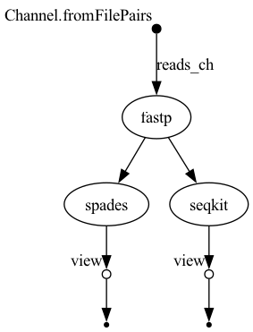

# Basic Bioinformatics Workflow with Nextflow

This repository contains a modular, reproducible **Nextflow** workflow for processing short-read sequencing data. 
It includes quality control, read trimming, assembly, and basic summary statistics. 
Versions of software used are at the bottom of this README.

This pipeline was developed and tested on:
> 💻 Apple Silicon M2 Max MacBook Pro 32GB RAM
> 🧪 macOS Sequoia 15.3.2  

---

## 📁 Repository Structure
<pre>
```
.
├── Data/                  # Raw input files (tracked with Git LFS)
├── modules/               # Individual process modules (e.g. fastp, spades, seqkit)
├── main.nf                # Main Nextflow workflow script
├── nextflow.config        # Pipeline configuration
├── flowchart.png          # Workflow diagram
├── .gitignore             # Ignores intermediate/output files
├── .gitattributes         # Git LFS tracking rules
└── README.md              # You're here!
```
</pre>


## 🚀 What This Pipeline Does

### 🔹 Modules Included:
- `fastp`: quality control and adapter trimming
- `seqkit`: basic summary statistics
- `spades`: genome assembly

### 🔹 Input:
Paired-end `.fastq.gz` files — already provided in the `Data/` folder  
> You do **not** need to move or rename them.

### 🔹 Output:
- Trimmed reads
- Assembly results
- Stats reports

---

## ⚙️ Requirements

Install the following tools before running the workflow:

### 1. Download the data from this OneDrive link
https://gtvault-my.sharepoint.com/:f:/g/personal/cchoudhry3_gatech_edu/Eq8523KpshVLnQ_btyxOVNABh9n7j8RlAByoCYA7nHRA0w?e=eQbTEm


I was previously using git-lfs, but this was causing issues due to their quota limits. So, upon cloning this GitHub Repo make sure to replace whatever data is in the Data folder
with whichever paired-end reads you download from that link. The files that may or may not appear when cloning this repo will merely be pointers, so it's very important to replace them with the data from the OneDrive link!
### 2. Install miniconda/conda 
Use the following website to learn how to install miniconda/conda for your system https://github.com/conda-forge/miniforge
### 3. Install Docker
Use this website https://www.docker.com and install Docker for your system. Make sure to have it already running prior to running the nextflow bash command below!!
<pre>
```bash
brew install git git-lfs     # or use your preferred package manager
git lfs install
git clone https://github.com/ChadChoudhry/my_first_wf.git
cd my_first_wf
conda create -n bioinfo-nf -c bioconda -c conda-forge nextflow graphviz
conda activate bioinfo-nf
nextflow run main.nf -profile test
```
</pre>
### 4. Output
Now, assuming nothing went wrong with installation, your output will contain a work/ directory automatically created by 
Nextflow and a results/ directory with all of the results.

### 5. Notes
This was done on: 
Nextflow version 24.10.4
miniconda version: 24.9.2
Also, the nextflow script uses docker to grab the latest versions of fastp, spades and seqkit from the staphb dockerhub website.
Lastly, this took roughly 18 minutes to run on my local machine, but I had many other things open at the same time.



